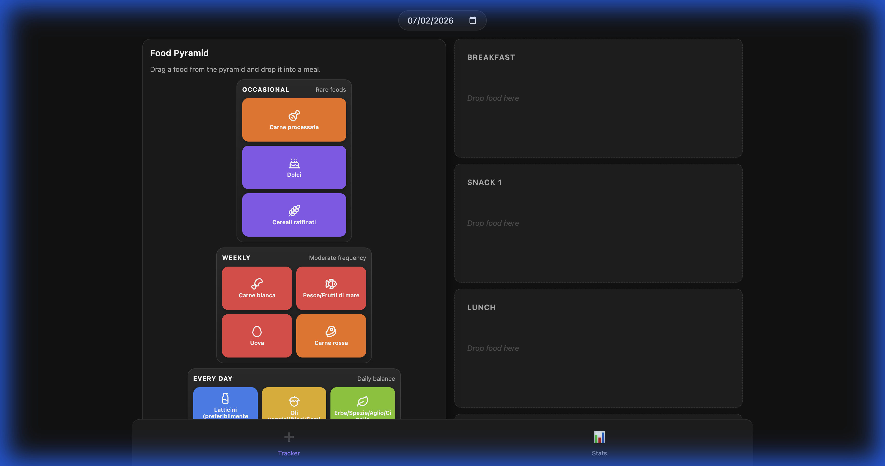
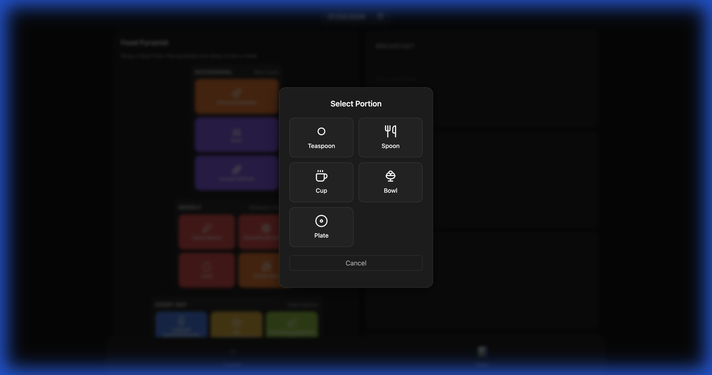
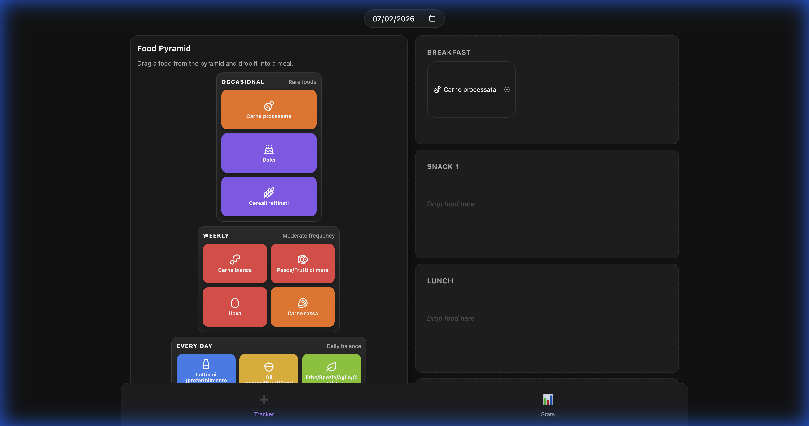
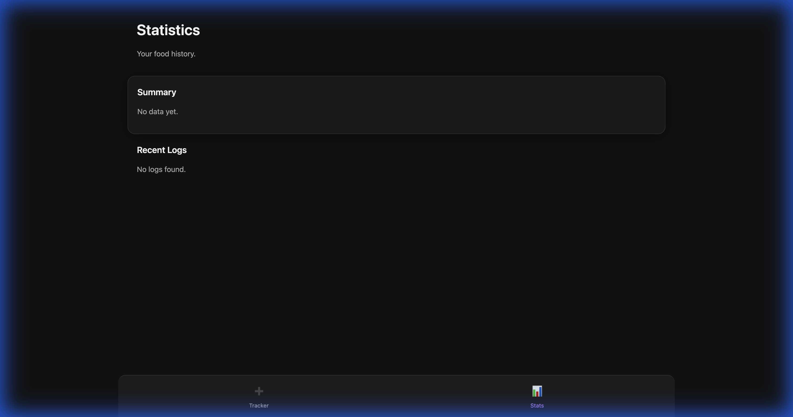

# Food Pyramid Tracker

A modern, interactive web application designed to help users track their daily food intake based on the nutritional principles of the Food Pyramid. Built with React and Vite, this tool offers a simple and engaging way to visualize and log meals.

It's built with Codex 5.3 Plus, 100% generated by AI with only feature and architectur indication.

## Features

- **Interactive Food Pyramid**: Foods are categorized into tiers:
  - **Every Main Meal**: Vegetables, Fruits, Whole Grains (Foundation)
  - **Every Day**: Dairy, Nuts/Seeds, Herbs/Spices, Legumes
  - **Weekly**: White Meat, Fish/Seafood, Eggs, Red Meat
  - **Occasional**: Processed Meats, Sweets, Refined Grains
- **Drag & Drop Interface**: Easily log meals by dragging food items from the pyramid directly into meal slots (Breakfast, Snacks, Lunch, Dinner).
- **Portion Control**: Select specific portion sizes for accurate tracking:
  - Teaspoon (Cucchiaino)
  - Spoon (Cucchiaio)
  - Cup (Tazzina)
  - Bowl (Ciotola)
  - Plate (Piatto)
- **Daily Persistence**: Your logs are saved locally, allowing you to track your intake day by day.
- **Responsive Design**: Designed to work seamlessly on both desktop and mobile devices, featuring swipe gestures to switch views on smaller screens.
- **Statistics Overview**: View a summary of your food intake history (currently under development/linked to API).

## Screenshots

### Dashboard & Food Pyramid
Navigate the full food pyramid and drag items to your daily meal plan.


### Drag & Drop Interaction
Intuitively drag food items to log them.


### Logged Meals
View your daily intake at a glance with portion indicators.


### Statistics
Track your consumption trends over time.


## Getting Started

### Prerequisites
- Node.js (v14 or higher)
- npm

### Installation

1. Clone the repository:
   ```bash
   git clone <repository-url>
   ```
2. Install dependencies:
   ```bash
   npm install
   ```

3. Start the development server:
   ```bash
   npm run dev
   ```

4. Open your browser and navigate to `http://localhost:3001` (or the port shown in your terminal).

## Tech Stack
- **Frontend**: React, Vite
- **Styling**: Vanilla CSS
- **Icons**: Lucide React
- **Drag and Drop**: @dnd-kit/core
